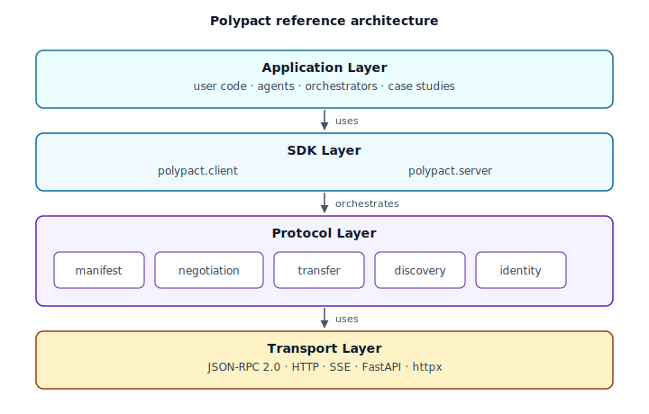
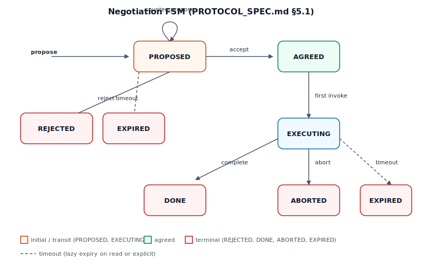

# Polypact

> A common language for AI agents under different ownership — companies, teams, or individuals — to work together under terms each side has agreed to, with a receipt that proves it.

## What this is, in plain English

AI assistants — "agents" — are starting to do real work: reading invoices, looking up stock, drafting reports, routing shipments. They get built or bought by all kinds of operators — companies, teams inside companies, public services, even individual developers running their own.

The trouble starts when **one agent needs help from another agent that someone else controls** — say, a different company, a different team, or another person altogether. Today there's no standard way for them to:

- introduce themselves and prove who they are,
- agree on what's allowed, for how long, and at what price,
- actually hand work off — or hand over a *recipe* so the other side can do it themselves.

**Polypact is the protocol that lets them do this.** Think of it as a contract negotiation between two AI agents that runs automatically, takes a fraction of a second, and ends with a digitally signed receipt both sides can audit later.

There are three ways one agent can share what it knows how to do:

| Mode | Everyday analogy |
|---|---|
| **Lease** | "You can use my service 50 times this hour for $X." Like a metered API plan. |
| **Teach** | "Here's the recipe — run it yourself." Like sharing a cookbook page under a license. |
| **Compose** | "Stitch my step into your pipeline; together we deliver one finished result." Like a supply chain. |

Every agreement is cryptographically signed, so neither side can later deny what was agreed. Every agent has a verifiable identity (a [DID](https://www.w3.org/TR/did-1.0/)), so you always know who you're dealing with.

> **Status:** research-stage reference implementation. The protocol works end-to-end across all three modes; no production deployments yet. See [Status](#status) for the build phase.

---

## What's different (for technical readers)

Polypact is a **framework-agnostic** protocol — it doesn't replace your agent runtime (LangGraph, AutoGen, custom Python, etc.); it sits in front of it as a thin adapter. It extends [Google A2A](https://github.com/a2aproject/A2A) with the primitives below, going beyond opaque task delegation.

| | A2A / ACP | Polypact |
|---|---|---|
| Task delegation | ✅ | ✅ |
| Capability discovery | ✅ (Agent Cards) | ✅ (extended manifests) |
| **Term negotiation** | ❌ | ✅ (propose / counter / accept FSM) |
| **Skill leasing** | ❌ | ✅ (budget-bounded, time-bounded) |
| **Skill teaching** (artifact transfer) | ❌ | ✅ (under license) |
| **Type-checked composition** | ❌ | ✅ (sequential & parallel) |
| Cross-boundary identity | partial | DID-based (Ed25519 / did:web) |
| Framework-agnostic | partial | ✅ (adapter-based) |

## Architecture

The reference implementation has four layers; the protocol library never imports from any agent framework outside `polypact.adapters/`.



| Module | Responsibility |
|---|---|
| `polypact.manifest` | Skill manifest schemas, validation, and composition compatibility |
| `polypact.negotiation` | The seven-state negotiation FSM, in-memory store, coordinator |
| `polypact.transfer` | The four transfer primitives: delegate, lease, teach, compose |
| `polypact.discovery` | Agent Card extension and manifest endpoints |
| `polypact.identity` | Ed25519 keys, did:web resolution, JWS signing/verification |
| `polypact.transport` | JSON-RPC 2.0 dispatcher, FastAPI router, httpx client |
| `polypact.client` / `polypact.server` | High-level SDK surface |

## The negotiation FSM

Every negotiation goes through an explicit state machine. Each transition emits a structured event for audit. Lazy expiry is applied on every read.



## End-to-end message flow

A typical lease flow: discover → negotiate → verify the signed agreement → invoke under budget. The diagram below loops the full sequence.



## See it run

Three runnable case studies — one per transfer mode. The lease example below auto-plays; the other two are tucked into expandable sections so the page stays scannable.

### Lease — invoice extraction

Discovery, counter-proposal, signed agreement, 50 invocations under budget, and the 51st rejected with `-32003 Agreement violated`.


```bash
uv run python -m examples.01_invoice_extraction.main
```

<details>
<summary><strong>Teach — research assistant</strong> (click to expand)</summary>

A specialist transfers a literature-review prompt template under license; the generalist renders it locally with no further provider involvement.


```bash
uv run python -m examples.02_research_assistant.main
```
</details>

<details>
<summary><strong>Compose — logistics pipeline</strong> (click to expand)</summary>

Three specialist agents (routing, inventory, ETA) plus a fulfillment orchestrator. The client negotiates compose, and the orchestrator type-checks the pipeline and emits one composite skill manifest.


```bash
uv run python -m examples.03_logistics_pipeline.main
```
</details>

## Quick start

```bash
# Install (Python 3.11+, requires uv: https://docs.astral.sh/uv/)
uv sync --extra dev

# Run the test suite
make check

# Run the case studies
uv run python -m examples.00_discovery.main
uv run python -m examples.01_invoice_extraction.main
uv run python -m examples.02_research_assistant.main
uv run python -m examples.03_logistics_pipeline.main
```

### Minimal server

```python
from polypact.identity import AgentKeypair
from polypact.manifest import ...  # build a SkillManifest
from polypact.server import PolypactServer

server = PolypactServer(
    agent_id="did:web:my-org.example.com",
    agent_name="MyAgent",
    agent_description="...",
    base_url="https://my-org.example.com",
    manifests=[...],
    signing_key=AgentKeypair.generate(did="did:web:my-org.example.com"),
)

@server.skill("did:web:my-org.example.com#my-skill")
async def handler(payload: dict) -> dict:
    return {"result": "..."}

# server.app() returns a FastAPI app you can serve with uvicorn.
```

### Minimal client

```python
from polypact.client import PolypactClient
from polypact.identity import DidResolver

async with PolypactClient(my_agent_id="did:web:caller.example.com") as client:
    card = await client.fetch_agent_card("https://my-org.example.com")
    proposal = await client.propose(
        card,
        skill_id="did:web:my-org.example.com#my-skill",
        transfer_mode="lease",
        proposed_terms=...,
    )
    agreement = await client.accept(card, negotiation_id=proposal.negotiation_id)
    await client.verify_agreement(agreement, resolver=DidResolver())
    output = await client.invoke_with_agreement(
        card, agreement=agreement, payload={...},
    )
```

## Conformance levels

The reference implementation supports all four levels from the spec.

| Level | Capability |
|---|---|
| **L1 — Discovery** | Agent Card + manifest list/fetch |
| **L2 — Delegation** | A2A-compatible `polypact.task.invoke` + composition compatibility checks |
| **L3 — Negotiation** | Full propose/counter/accept/reject FSM with signed agreements |
| **L4 — Transfer** | Lease, teach, and compose primitives with did:web identity |

## Case studies

Three runnable examples in [`examples/`](examples/):

| Example | Mode | What it shows |
|---|---|---|
| [01_invoice_extraction](examples/01_invoice_extraction/) | lease | 50-invocation budget; 51st rejected with `-32003 Agreement violated` |
| [02_research_assistant](examples/02_research_assistant/) | teach | Prompt template transferred under license; rendered locally |
| [03_logistics_pipeline](examples/03_logistics_pipeline/) | compose | Three specialist skills typed-checked into one composite skill |

Each runs in-process via `httpx.ASGITransport` with one command and produces console output structured for paper-figure legibility.

## Repository layout

```
polypact/
├── src/polypact/        Reference implementation
│   ├── manifest/        Skill manifest schemas + compatibility (§3)
│   ├── negotiation/     Seven-state FSM, store, coordinator (§5)
│   ├── transfer/        delegate, lease, teach, compose (§6)
│   ├── discovery/       Agent Card extension + manifest endpoints (§4)
│   ├── identity/        Ed25519 keys, did:web, JWS (§7)
│   ├── transport/       JSON-RPC 2.0 over HTTP (§2)
│   ├── adapters/        Framework adapters (only place framework imports allowed)
│   ├── client.py        High-level client SDK
│   └── server.py        FastAPI app factory
├── tests/
│   ├── unit/            Fast, in-process tests
│   └── integration/     End-to-end protocol flows via ASGI transport
├── examples/            Runnable case studies
├── docs/diagrams/       Architecture and protocol diagrams (SVG)
└── ROADMAP.md           Phased build plan
```

## Status

| Phase | Status |
|---|---|
| 0 — Initialization | ✅ |
| 1 — Manifests + Transport (L1) | ✅ |
| 2 — Composition + Delegate (L2) | ✅ |
| 3 — Negotiation FSM (L3) | ✅ |
| 4 — Transfer Primitives + Identity (L4) | ✅ |
| 5 — Case Studies | ✅ |
| 5b — Reference Adapter | 🚧 |

82 tests pass; `mypy --strict` and `ruff` clean across the codebase.


## License

TBD — likely Apache 2.0 to match the A2A ecosystem.
